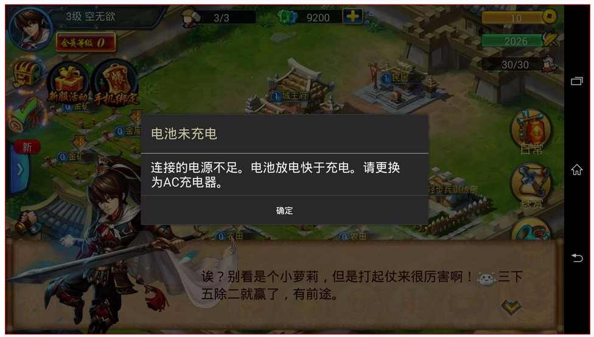

[](https://godoc.org/github.com/BigWavelet/go-minicap)

This is a minicap library written based on golang.


## Usage

you can fetch the library by
```shell
go get github.com/BigWavelet/go-minicap
```
then you can use it as follows

```go
package main

import (
	"fmt"
    "log"
	"image/jpeg"
	"os"
	"time"
    "github.com/BigWavelet/go-minicap"
)

func main() {
	serial := "EP7333W7XB" //your serial here...
	option := minicap.Options{}
	option.Serial = serial
	m, err := minicap.NewService(option)
	if err != nil {
		log.Fatal(err)
	}

	err = m.Install()
	if err != nil {
		log.Fatal(err)
	}
	log.Println(m.IsSupported())

	log.Println("start to capture")
	imageC, err := m.Capture()
	if err != nil {
		log.Fatal(err)
	}
	log.Println("capture finished..")

	for im := range(imageC) {
		log.Println(im)
	}

	log.Println("Start to close minicap")
	err = m.Close()
	if err != nil {
		log.Fatal(err)
	}
}
```

## demo

you can run the demo file ./demo/demo.go

then you can visit http://127.0.0.1:5678 to see the screen in real-time. Like,

